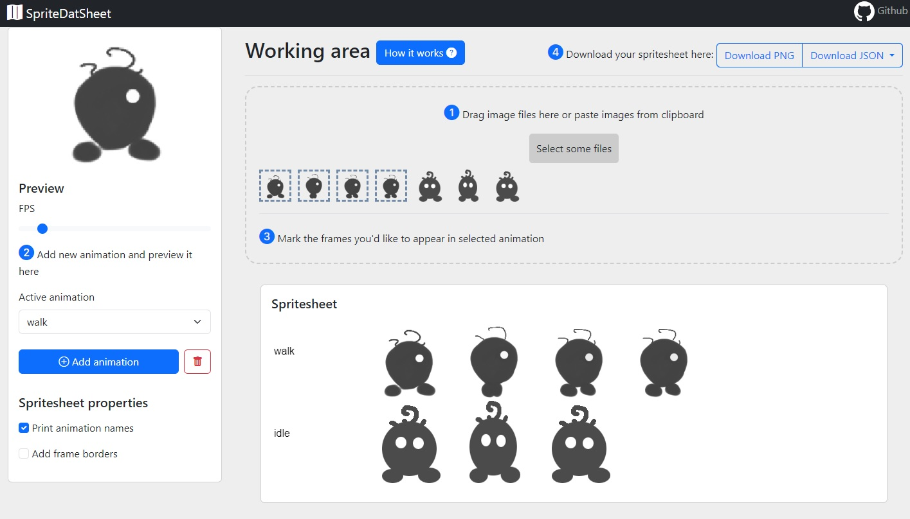

# SpriteDatSheet
### The spritesheet generator for animating your frames

This software allows you to pack your animation frames into a spritesheet (characters, assets, etc) to use in the popular 2D engines (e.g PixieJS).

It doesn't upload your assets anywhere, works right in your browser.

Give it a try: [https://paulsmith220.github.io/SpriteDatSheet/](https://paulsmith220.github.io/SpriteDatSheet/)

## This is how you use it:
> You will find more detailed instruction if you click [How it works :grey_question:] button next to the working area.

1. Grab your PNG files and drop them in the drop area (marked with :one:).
Alternatively, you could paste the image (or a group of images) from the clipboard: copy it, click the drop area and press Ctrl+V (Windows) or Cmd+V (Mac). You will see your files appearing underneath.

2. In the sidebar on the left click [Add animation] button. The prompt will appear - enter the name of the animation in prompt (e.g. "Running_left").
The animation will be created and automatically selected as "Active anmiation"

3. In the working area click on the frames (marked with :three:) you'd like to be a part of the selected animation in the order you want them.

    You will immediately see the animation preview in the sidebar on the left. Feel free to adjust the FPS to your needs (it's only affecting the preview).

    You will also immediately see the spritesheet preview under the working area. It's scaled down to fit the window, don't worry, you're getting it in full resolution later.

4. Configure spritesheet to your needs using checkboxes in the "Spritesheet properties" section of the sidebar

5. Add more animations using [Add animation] button
    
    Delete selected animation using delete button

6. Once you're happy with the result - go to the download section (marked with :four:).

    Use [Download PNG] button to download the complete spritesheet PNG image.

    Use [Download JSON] button to download the spritesheet data file in the format of your choice.